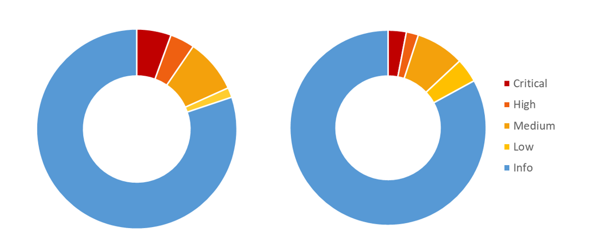

# 프로젝트 소개

## 프로젝트 개요

Metasploitable3 Windows Server 2008 R2 및 Ubuntu 14.04 환경을 대상으로 취약점 진단 및 모의침투를 수행한 프로젝트입니다.

공격자 관점에서 정보 수집, 취약점 분석, 초기 침투, 권한 상승 및 포스트 익스플로잇 단계를 수행하여 실제 공격 가능성을 검증하였으며, 발견된 취약점에 대한 보안 대책을 수립하였습니다.

---

## 프로젝트 목표

* 취약점 진단 도구(OpenVAS, Nessus)를 활용한 취약점 식별
* 실제 공격 시나리오 기반 침투 테스트 수행
* Windows 및 Linux 환경 권한 상승 검증
* 시스템 및 서비스 보안 설정 분석
* 보안 대책 및 개선 방안 도출

---

## 진단 배경 및 목적

단순 취약점 스캐닝 결과를 확인하는 수준을 넘어 실제 공격자의 관점에서 시스템이 어떻게 침해될 수 있는지 검증하고자 하였습니다.

정보 수집부터 초기 침투, 권한 상승, 중요 정보 수집까지의 과정을 수행하여 공격 경로를 분석하고 보안상 취약한 요소를 식별하였습니다.

---

## 수행 시나리오

본 프로젝트는 PTES(Penetration Testing Execution Standard) 방법론을 참고하여 수행하였습니다.

1. 정보 수집
2. 취약점 분석
3. 초기 침투
4. 권한 상승
5. 포스트 익스플로잇
6. 보안 대책 수립

---

## 진단 대상 및 범위

| 역할       | 운영체제                   | IP        |
| -------- | ---------------------- | --------- |
| Attacker | Kali Linux             | 10.0.0.31 |
| Target A | Windows Server 2008 R2 | 10.0.0.41 |
| Target B | Ubuntu 14.04           | 10.0.0.51 |

진단 범위는 네트워크 서비스, 웹 애플리케이션, 데이터베이스 및 원격 접속 서비스를 포함하며 취약점 식별부터 침투 검증, 권한 상승 및 정보 수집까지 수행하였습니다.

---

## 수행 환경 및 사용 도구

| 구분      | 사용 도구                                |
| ------- | ------------------------------------ |
| 정보 수집   | Nmap, Netcat                         |
| 취약점 진단  | OpenVAS, Nessus                      |
| 공격 수행   | Metasploit Framework                 |
| 패킷 분석   | Wireshark, tshark                    |
| 분석 및 복구 | CyberChef, Binwalk, mysqlbinlog, HxD |

---

## PTES 기반 진단 방법론

본 프로젝트는 PTES 절차를 기반으로 수행하였으며, 각 공격 단계에서 수행된 행위는 MITRE ATT&CK Framework 기준으로 분류 및 분석하였습니다.

---

## 진단 결과 요약

FTP, SMB, 웹 애플리케이션, 데이터베이스 및 원격 관리 서비스에서 정보 노출 및 원격 공격이 가능한 취약점이 확인되었습니다.

또한 공개 취약점과 취약한 계정 정책을 이용하여 시스템 접근 및 관리자 권한 획득이 가능함을 검증하였습니다.

---

## 주요 발견 취약점

| 구분         | 위험도      | 주요 내용                           |
| ---------- | -------- | ------------------------------- |
| 인증 및 접근 통제 | Critical | 취약한 계정 관리, Jenkins/Tomcat 익명 접근 |
| 시스템 보안     | High     | sudo NOPASSWD 설정, 불필요 서비스 활성화   |
| 정보 노출      | Medium   | DB 계정 정보 노출, 디렉터리 리스팅, 배너 정보 노출 |

---

## 핵심 공격 시나리오

### Windows

* MS17-010(EternalBlue) 취약점 악용
* Meterpreter 세션 획득
* SYSTEM 권한 획득

### Linux

* Apache Continuum RCE 취약점 악용
* Reverse Shell 획득
* Root 권한 획득

### Post Exploitation

* 데이터베이스 분석
* 중요 정보 수집
* Flag 획득

---

## 보안 대책

* 공개 취약점 패치 적용
* 기본 계정 제거
* 최소 권한 원칙 적용
* 관리자 페이지 접근 통제 강화
* 정기 취약점 진단 및 모니터링 체계 구축

---

## 프로젝트 수행 소감

실제 침투 테스트 과정에서는 공개 취약점보다도 기본 계정 사용, 취약한 인증 정책, 패치 미적용과 같은 기본적인 보안 관리 미흡이 더 큰 위험 요소가 될 수 있음을 확인할 수 있었습니다.

또한 자동화 도구와 수동 검증을 병행하며 공격 가능성을 검증하였고, 침투 과정에서 발생한 다양한 문제를 분석하고 해결하며 트러블슈팅 역량을 향상시킬 수 있었습니다.
