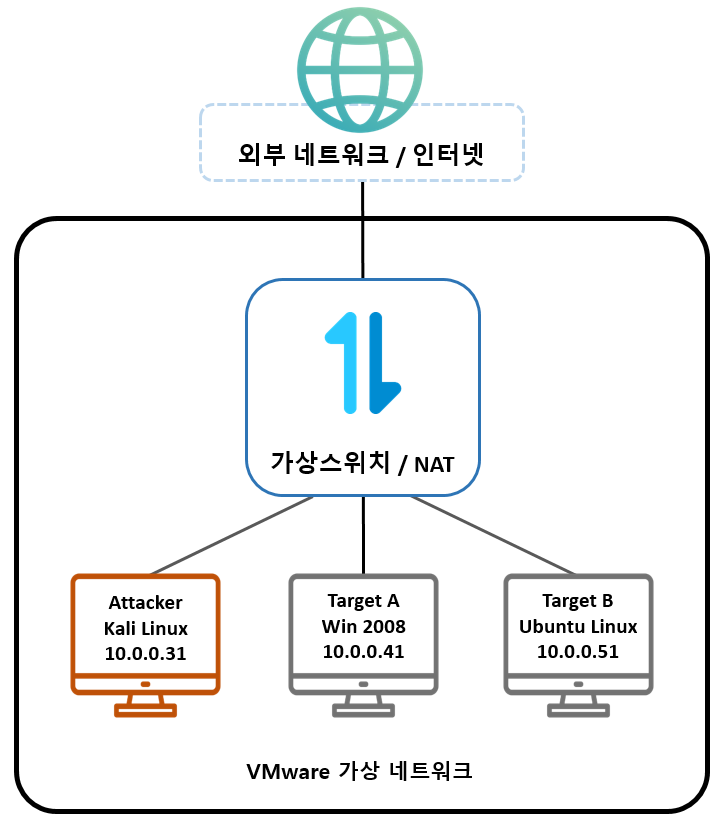

# 진단 환경 구성

## 환경 개요

본 프로젝트는 VMware Workstation 기반의 가상 환경에서 수행하였습니다.

- Attacker : Kali Linux
- Target A : Metasploitable3 Windows Server 2008 R2
- Target B : Metasploitable3 Ubuntu 14.04

---

## 네트워크 구성도

---

## 진단 대상

| 역할 | 운영체제 | IP 주소 |
|--------|--------|--------|
| Attacker | Kali Linux | 10.0.0.31 |
| Target A | Windows Server 2008 R2 | 10.0.0.41 |
| Target B | Ubuntu 14.04 | 10.0.0.51 |

---

## 주요 서비스

### Windows Server 2008 R2

- FTP
- IIS
- GlassFish
- Jenkins
- Elasticsearch
- Axis2
- Ruby on Rails

### Ubuntu 14.04

- Apache
- Drupal
- MySQL
- SSH
- Apache Continuum
- CUPS

---

## 사용 도구

| 구분 | 도구 |
|--------|--------|
| 정보 수집 | Nmap, Netcat |
| 취약점 진단 | OpenVAS, Nessus |
| 공격 수행 | Metasploit Framework, smbclient, SSH |
| 패킷 분석 | Wireshark, tshark |
| 분석 및 복구 | CyberChef, Binwalk, HxD, 7z, mysqlbinlog, UPX |

---

## 진단 범위

- 네트워크 서비스 식별
- 웹 애플리케이션 분석
- 취약점 식별 및 검증
- 초기 침투
- 권한 상승
- 포스트 익스플로잇
- 중요 정보 수집 및 분석
